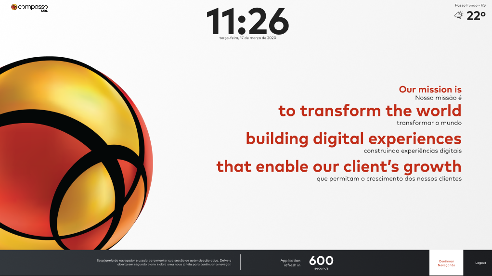

<h1 align="center">
    
    
</h1>

<h1 align="center">
   <a href="#"> Keep Alive </a>
</h1>

<h3 align="center">
    Fourth front-end challenge of the Compass.uol scholarship program
</h3>

  

  

  
    
   
   

<h4 align="center"> 
	 Status: Done
</h4>

 <a href="#about">About</a> •
 <a href="#features">Features</a> •
 <a href="#author">Author</a> • 
 <a href="#user-content-license">License</a>

## About

A website that promotes greater integration and centralization of functionality for employees at Compass who can safely access and enjoy the available functionalities, a login that can allow good usability to the user.

---

## Features

- [X] Login
    - [X] Structure
    - [X] stylization
    - [X] responsive design
    - [X] Save credentials to localStorage
- [X] Login Filled
    - [X] Logic to change the icons (animation of the icons)
- [X] Login Error
    - [X] Form validation with mockup - mock
    - [X] error message
    - [X] border with another color
- [X] Home
    - [X] Time and day of the week
    - [X] climate and location
    - [X] Structure
    - [X] stylization
    - [X] responsive design
    - [X] refresh with time
    - [X] link to uol news
    - [X] logout and localStorage remove
    - [X] Popup -> Stay Logged In (Yes / No - Clear localStorage)

---

## Author

<a href="#">
 
<h2>Robert José</h2>

 

---

## License

This project is under the license [MIT](./LICENSE).

Made with love by Robert J. :)